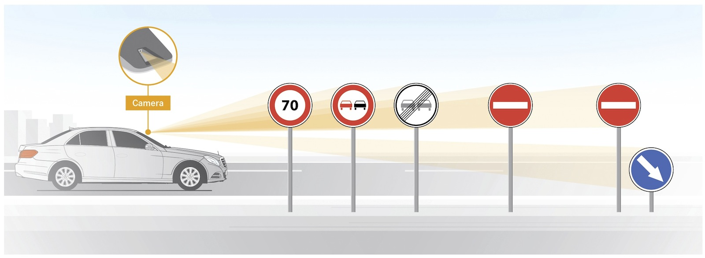
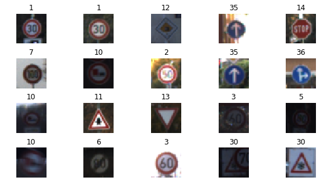
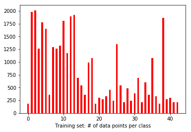
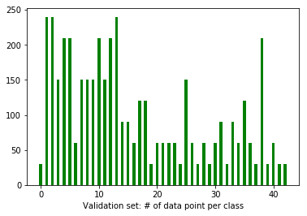
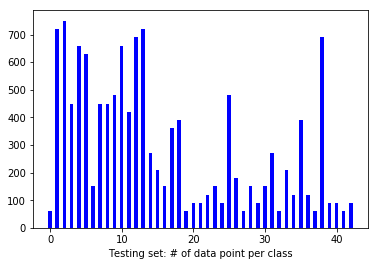
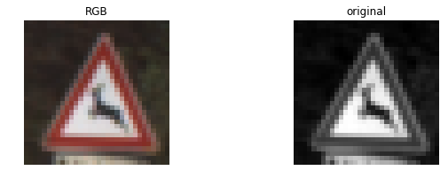
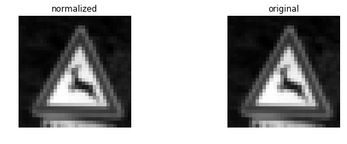
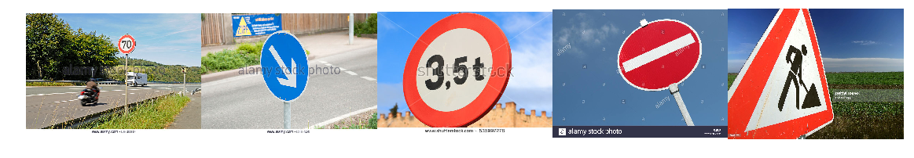
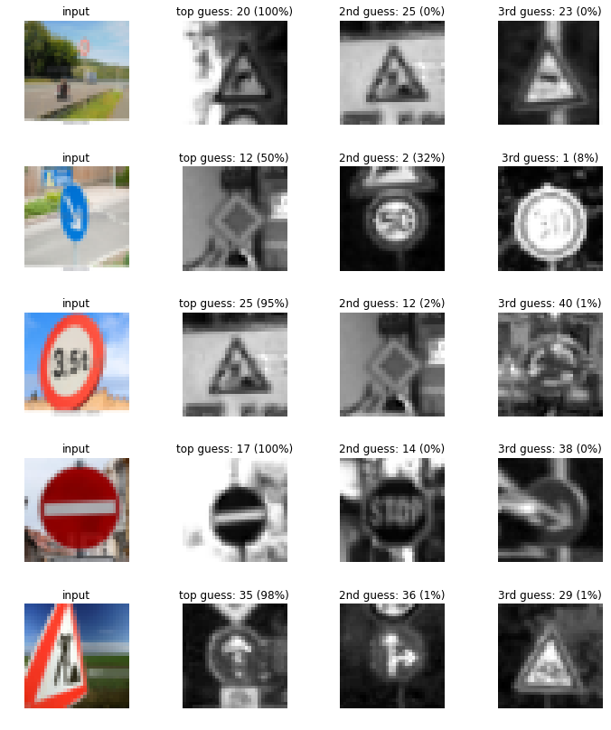

# SDC-TrafficSignDetection
Self-driving car project: Detecting Traffic Signs

# Self-Driving Car Project: Traffic Sign Classification

Hello there! I'm Babak. Let me introduce you to my second project in the self-driving car projects series. In this project I built a classifier to detect traffic signs on the road using convolutional nueral network with LaNet architecture, this is an important step in developing a self-driving car. Algorithm for this project is written in Python using TensorFlow, numpy, pickle and matplotlib libraries. The algorithm was trained on german traffic sign dataset and tested on actual traffic sign images.

**Contents**   

* Python Script
* Jupyter notebook
* Test_traffic_signs folder
* Readme file
* Readme_images folder

### Pipeline:
The pipeline for detecting lane lines on the road is as follows:

1. Loading the data set (German Traffic Signs.)
2. Exploring, summarizing and visualizing the data set.
3. Preprocessing the data (grayscale, normalize)
4. Designing and implementing a convolutional nueral network model with LeNet-5 architecture.
5. Training, validating and testing the model.
6. Testing the model on new traffic sign images.
7. Analyze the softmax probabilities of the new images

### Writeup:

#### Data Set Summary & Exploration

I used the numpy, pickle and pandas libraries to calculate summary statistics of the traffic
signs data set:

* The size of training set: 34799
* The size of the validation set: 4410
* The size of test set: 12630
* The shape of a traffic sign image: 32px x 32px x 3 
* The number of unique classes/labels in the data set: 43

Sample of the data set is shown here:

Here is an exploratory visualization of the data set. It is a bar chart showing number of data points per class for training, validation and testing data set.

#### Data Set Preprocessing

I preprocessed the data. As a first step, I converted the images to grayscale to train efficeintly and less complexity. It is better to train the model on single channel images first.

Here is an example of a traffic sign image before and after grayscaling.

As a last step, I normalized the image data to change the range of pixel intensity to a range that is more normal to the senses. The mean of the normalized image is 0 and variance is 1. 

<!--I decided to generate additional data because ... 

To add more data to the the data set, I used the following techniques because ... -->

Here is an example of an original image and a normalized image:

<!--The difference between the original data set and the augmented data set is the following ... -->

#### Design and Test a Model Architecture

My final model architecture wass LeNet-5 and it consisted of the following layers:

| Layer         			|     Description	| 
|:---------------------:|:---------------------------------------------:| 
| Convolution 5x5     	| input: 32x32x1, output: 28x28x6 	|
| RELU						| Activation layer	|
| Max pooling	      		| input: 28x28x6, output: 14x14x6 	|
| Convolution 5x5     	| input: 14x14x6, output: 10x10x16 	|
| RELU						| Activation layer	|
| Max pooling	      		| input: 10x10x16, output: 5x5x16 	|
| Flattening	    		| input: 5x5x16, output: 400      	|
| Fully connected		| input: 400, output: 120         	|
| RELU						| Activation layer  	|
| Dropout					| Dropout Layer		|
| Fully connected		| input: 120, output: 84  	|
| RELU						| Activation layer  	|
| Dropout					| Dropout Layer		|
| Fully connected		| input: 84, output: 43  	|

To train the model, I used the Adam optimizer. The final hyper parameters used were:
batch size: 120
epochs: 100
learning rate: 0.0007
mu: 0
sigma: 0.1
dropout keep probability: 0.5

My final model results were:
* validation set accuracy: 97.3%
* test set accuracy: 95%
 

###Test a Model on New Images

Here are five German traffic signs that I found on the web:

The images I chose were very difficult and challenging to classify because they're at different angles, distances with various backgrounds. Also, the German Traffic Sign dataset contain a border of 10 % around the actual traffic sign to allow for edge-based approaches but my images don't have such a border. This could be another source of confusion for the model.

Here are the results of the prediction:
 
 [20, 12, 25, 17, 35] <-predictions labels
 
 [4, 38, 16, 17, 25] <-actual labels

Test Set Accuracy = 0.200
<!--| Image			        |     Prediction	        					| 
|:---------------------:|:---------------------------------------------:| 
| Stop Sign      		| Stop sign   									| 
| U-turn     			| U-turn 										|
| Yield					| Yield											|
| 100 km/h	      		| Bumpy Road					 				|
| Slippery Road			| Slippery Road      							|-->

The model was able to correctly guess 1 of the 5 traffic signs, which gives an accuracy of 20%. 

The top soft max probabilities for each image were:

<!--| Probability         	|     Prediction	        					| 
|:---------------------:|:---------------------------------------------:| 
| .60         			| Stop sign   									| 
| .20     				| U-turn 										|
| .05					| Yield											|
| .04	      			| Bumpy Road					 				|
| .01				    | Slippery Road      							|-->
<!--softmax-->

<!--For the second image ... 

### (Optional) Visualizing the Neural Network (See Step 4 of the Ipython notebook for more details)
####1. Discuss the visual output of your trained network's feature maps. What characteristics did the neural network use to make classifications?-->

